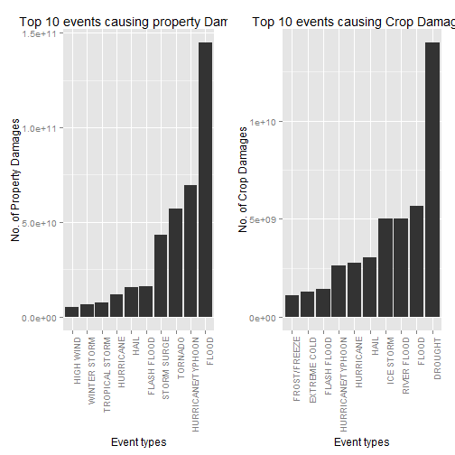

##Impact on  public health and economy due to severe weather events

###Synopsis
Storms and other dangerous weather effects can cause both public health and economic problems for residential areas and municipalities. Many severe cases can result in fatalities, injuries, and property damage, and preventing such issues to the extent possible is a key worry. This project involves researching the U.S. National Oceanic and Atmospheric Administration's (NOAA) storm database. This database covers the features of major storms and weather events in the United States, including when and where they take place, as well as estimates of any fatalities, injuries, and property damage. And I addresses two thins across the United States, which types of events (as indicated in the EVTYPE variable) are most harmful with respect to population health and which types of events have the greatest economic consequences?

###Data Processing
Firstly it checks that whether this file exist in your current directory. If it exists then it will start reading csv, otherwise it will download that file and the read csv from that, and load some required libraries.

```r
library(ggplot2)
library(knitr)
library(gridExtra)

file<-"./data/repdata-data-StormData.csv.bz2"
if (file.exists(file)){
DataSet<-read.csv(bzfile(file))
}else{
temp <- tempfile()
download.file("https://d396qusza40orc.cloudfront.net/repdata%2Fdata%2FStormData.csv.bz2",temp)
DataSet <- read.csv(bzfile(temp, "temp.csv"))
unlink(file)
}
```
and then I use convert BGN_DATE and END_DATE to standard time format.


```r
DataSet$BGN_DATE <- strptime(as.character(DataSet$BGN_DATE), format = "%m/%d/%Y %H:%M:%S")
DataSet$END_DATE <- strptime(as.character(DataSet$END_DATE), format = "%m/%d/%Y %H:%M:%S")
```
###Results

####Type of events which are most harmful to population health:
For analyzing their harmfil impact on public health, I analyzed injuries and fatalities. Firsty I analyzed events with respect to injuries

```r
InjuriesPerEvent<-aggregate(DataSet$INJURIES, by=list(Category=DataSet$EVTYPE), FUN=sum)

TopInjuries<-InjuriesPerEvent[order(InjuriesPerEvent[,2],decreasing = T),][1:10,]

p1<-ggplot(TopInjuries, aes(x = reorder(factor(TopInjuries[,1]), TopInjuries[,2]), y = TopInjuries[,2])) + geom_bar(stat = "identity")+theme(axis.text.x = element_text(angle = 90, hjust = 1,size = 8.5))+ xlab("Event types") +
        ylab("No. of Injuries") +ggtitle("Top 10 events causing injuries")
```
and then I analyzed events with respect to fatalities,

```r
FatalitiesPerEvent<-aggregate(DataSet$FATALITIES, by=list(Category=DataSet$EVTYPE), FUN=sum)

TopFatalities<-FatalitiesPerEvent[order(FatalitiesPerEvent[,2],decreasing = T),][1:10,]

p2<-ggplot(TopFatalities, aes(x = reorder(factor(TopFatalities[,1]), TopFatalities[,2]), y = TopFatalities[,2])) + geom_bar(stat = "identity")+theme(axis.text.x = element_text(angle = 90, hjust = 1,size = 8.5))+ xlab("Event types") +
        ylab("No. of Fatalities") +ggtitle("Top 10 events causing fatalities")
```
and plotting the top 10 events affecting injuries and fatalities into one figure,

```r
grid.arrange(p1, p2,ncol=2,nrow=1)
```

 

which shows that top events that has huge impact on public health are:


```r
intersect(InjuriesPerEvent[order(InjuriesPerEvent[,2],decreasing = T),][1:10,][,1],FatalitiesPerEvent[order(FatalitiesPerEvent[,2],decreasing = T),][1:10,][,1])
```

```
## [1] "TORNADO"        "TSTM WIND"      "FLOOD"          "EXCESSIVE HEAT"
## [5] "LIGHTNING"      "HEAT"           "FLASH FLOOD"
```

###Type of events which have the greatest economic consequences
For analyzing impact on economic consequences, I analyzed property damage and crop damage. Firsly I analyzed property damage

For this, I ignore unknown values for PROPDMGEXP, whose value is:
 - ? + 0 1 2 3 4 5 6 7 8 h H
 and for remaining rows, I convert them to numeric from, which include conversion like    
 1. Values like "k" or "K" mean Thousand   
 2. Values like "m" or "M" mean Million   
 3. Values like "b" or "B" mean Billion   
 

```r
PropertyDamage<-DataSet[(DataSet$PROPDMGEXP==""),c("PROPDMG","EVTYPE")]

temp<-DataSet[(DataSet$PROPDMGEXP=="k"|DataSet$PROPDMGEXP=="K"),c("PROPDMG","EVTYPE")]
PropertyDamage<-rbind(PropertyDamage,data.frame(PROPDMG=temp$PROPDMG*10^3,EVTYPE=temp$EVTYPE))

temp<-DataSet[(DataSet$PROPDMGEXP=="m"|DataSet$PROPDMGEXP=="M"),c("PROPDMG","EVTYPE")]
PropertyDamage<-rbind(PropertyDamage,data.frame(PROPDMG=temp$PROPDMG*10^6,EVTYPE=temp$EVTYPE))

temp<-DataSet[(DataSet$PROPDMGEXP=="b"|DataSet$PROPDMGEXP=="B"),c("PROPDMG","EVTYPE")]
PropertyDamage<-rbind(PropertyDamage,data.frame(PROPDMG=temp$PROPDMG*10^9,EVTYPE=temp$EVTYPE))
```

then taking sum for corresponding type of events, and taking out top 10 events type that impact property damages,

```r
PropertyDamagePerEvent<-aggregate(PropertyDamage$PROPDMG, by=list(Category=PropertyDamage$EVTYPE), FUN=sum)
TopPropertyDamages<-PropertyDamagePerEvent[order(PropertyDamagePerEvent[,2],decreasing = T),][1:10,]
p3<-ggplot(TopPropertyDamages, aes(x = reorder(factor(TopPropertyDamages[,1]), TopPropertyDamages[,2]), y = TopPropertyDamages[,2])) + geom_bar(stat = "identity")+theme(axis.text.x = element_text(angle = 90, hjust = 1,size = 8.5))+ xlab("Event types") +
        ylab("No. of Property Damages") +ggtitle("Top 10 events causing property Damages")
```


After that, I analyzed crop damage

And doing the same, I ignore unknown values for CROPDMGEXP, whose value is:    
 - ? + 0 1 2 3 4 5 6 7 8 h H    
 and for remaining rows, I convert them to numeric from, which include conversion like    
 1. Values like "k" or "K" mean Thousand    
 2. Values like "m" or "M" mean Million    
 3. Values like "b" or "B" mean Billion    
 

```r
CropDamage<-DataSet[(DataSet$CROPDMGEXP==""),c("CROPDMG","EVTYPE")]

temp<-DataSet[(DataSet$CROPDMGEXP=="k"|DataSet$CROPDMGEXP=="K"),c("CROPDMG","EVTYPE")]
CropDamage<-rbind(CropDamage,data.frame(CROPDMG=temp$CROPDMG*10^3,EVTYPE=temp$EVTYPE))

temp<-DataSet[(DataSet$CROPDMGEXP=="m"|DataSet$CROPDMGEXP=="M"),c("CROPDMG","EVTYPE")]
CropDamage<-rbind(CropDamage,data.frame(CROPDMG=temp$CROPDMG*10^6,EVTYPE=temp$EVTYPE))

temp<-DataSet[(DataSet$CROPDMGEXP=="b"|DataSet$CROPDMGEXP=="B"),c("CROPDMG","EVTYPE")]
CropDamage<-rbind(CropDamage,data.frame(CROPDMG=temp$CROPDMG*10^9,EVTYPE=temp$EVTYPE))
```

then taking sum for corresponding type of events, and taking out top 10 events type that impact crop damages,

```r
CropDamagePerEvent<-aggregate(CropDamage$CROPDMG, by=list(Category=CropDamage$EVTYPE), FUN=sum)
TopCropDamages<-CropDamagePerEvent[order(CropDamagePerEvent[,2],decreasing = T),][1:10,]
p4<-ggplot(TopCropDamages, aes(x = reorder(factor(TopCropDamages[,1]), TopCropDamages[,2]), y =   TopCropDamages[,2])) + geom_bar(stat = "identity")+theme(axis.text.x = element_text(angle = 90, hjust = 1,size = 8.5))+ xlab("Event types") +
ylab("No. of Crop Damages") +ggtitle("Top 10 events causing Crop Damages")
```
and plotting top ten event types impacting economy

```r
grid.arrange(p3, p4,ncol=2,nrow=1)
```

 

which shows that top events that has huge impact on economy are:


```r
intersect(TopCropDamages[,1],TopPropertyDamages[,1])
```

```
## [1] "FLOOD"             "HAIL"              "HURRICANE"        
## [4] "HURRICANE/TYPHOON" "FLASH FLOOD"
```
